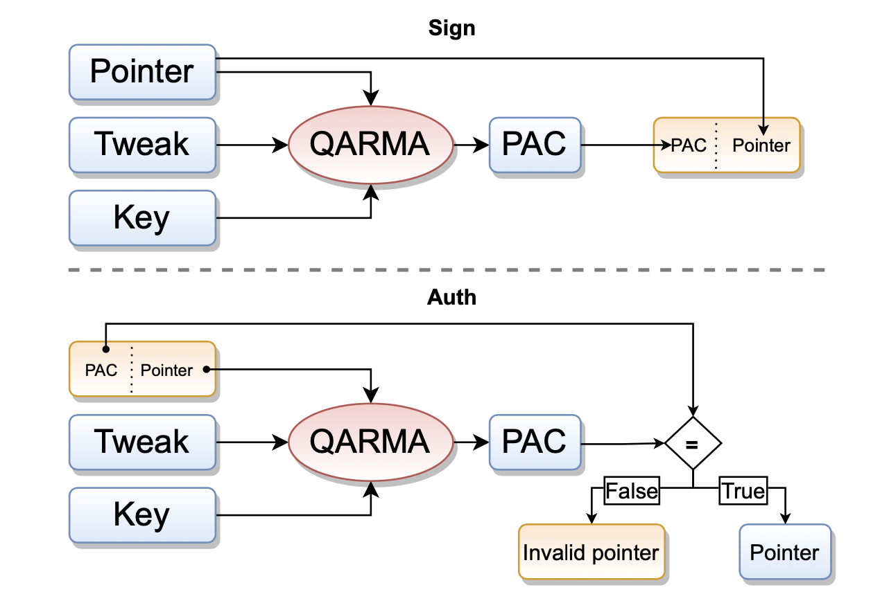
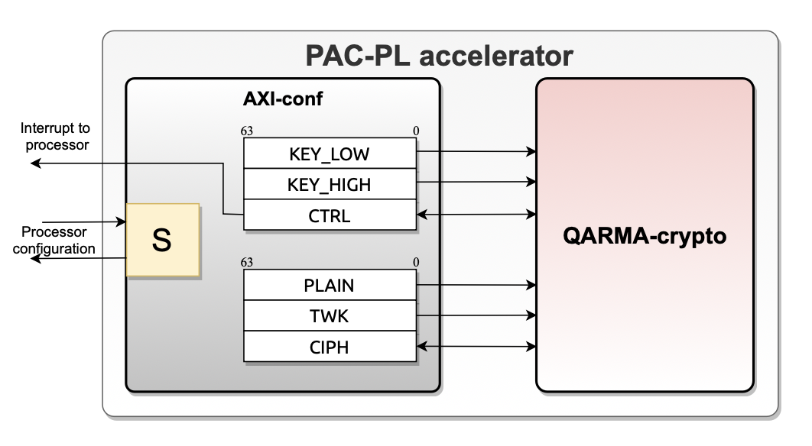
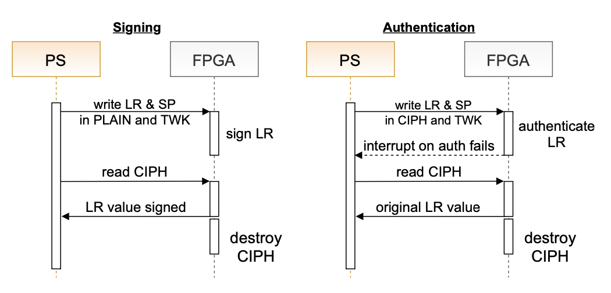
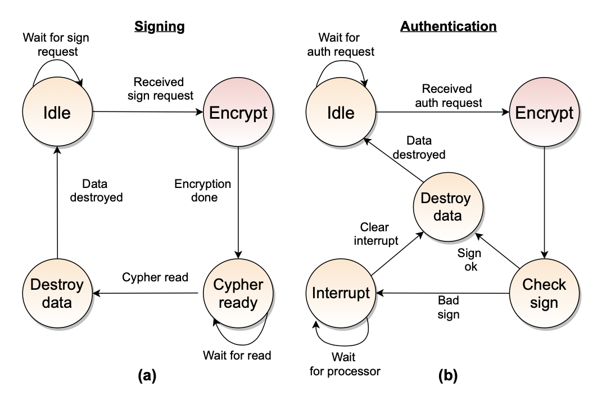

# PAC-PL: Enabling Control-Flow Integrity with Pointer Authentication in FPGA SoC Platforms

[All the contents in this document are a re-elaboration of the linked paper](https://retis.sssup.it/~a.biondi/papers/RTAS22)

CFi is an effective technique to enhance the security of software systems.
Since recently we now have **hardware support** for the feature (like the pointer authentication PA of the ARMv8.3 arch).
Together with the hardware support we also need support from the compiler and the Linus OS.

The idea they propose is to implement the _pointer authentication code_ mechanism inside a programmable logic block.

## Introduction

Security in embedded systems is particularly critical since they usually control physical systems.
The main attacks are possible thanks to the presence of _memory corruption_ that is hard to detect at testing time.
An attacker can exploit memory corruption vulnerabilities to change the canonical execution flow of a program by changing
part of the data in memory (like pointers pushed onto the stack).
Such attacks fall under the umbrella of **CRA, code reuse attacks** (return to libc).

One of the techniques to contrast this problem is the usage of **CFI, control flow integrity** that aims to ensure the
execution flow of a process always corresponds to the legal one specified at compile time.

We can accomplish CFI with two approaches, a pure-software implementation (big overhead) or with hardware support.
The leading example of hw-support currently is ARM's **_pointer authentication_**.
The advantage of this mechanism is that it's transparent to the programmer and so requires support at the compiler and
OS level.

## CFI

The idea behind CFI is to compute all the legal paths defined by the canonical CFG and then enforce them.
Arcs can be **forward** (branches/function calls) or **backward** (return).
Then jumps can be **direct** (the jump destination is known at compile time) or **indirect** (the jump destination is
computed at run-time using a value inside a register).

Almost all CFI techniques watch over a program execution to ensure that the target of an indirect branch is the intended
instruction. At each function return, they verify that the control comes back to the calling function.
Direct branches and function calls are rarely supervised, especially if the code section is read-only.

### CFI implementations

As we said we can have software implementation or hardware implementations.
The software ones introduce a significant overhead. The hardware ones on the other hand work by cryptographically
authenticating the content of a register before using it.

### PA in ARMv8-A

On ARMv8-A Linux kernel (aarch64) only the least significant 48 bits are used as an address for the memory-mapped space,
and so the idea is to use the 16 most significant bits to embed a cryptographic checksum (PAC) obtained by truncating
the output of the QARMA algorithm.

QARMA guarantees authenticity and integrity through **tweaks** (= the permutation computed by the algorithm on the
plaintext is determined by a secret key and an additional salt value, for example the stack pointer that enables the
discrimination of where the authenticated pointer can actually be used).

So, to compute the PAC we need three inputs:

- the value of the memory pointer
- a secret key (stored in dedicated processor registers)
- the context information (the stack pointer)

Before using a signed pointer you must authenticate it (otherwise it's not a valid pointer).
The **auth** process simply recomputes the PAC for the pointer using the key and the context, and it compares the two
signatures.

To enable this mechanism the architecture has five 128 bit registers dedicated for this purpose.
The problem is that the whole key-management mechanism is left up to the programmer to handle (the registers are not
accessible at EL) but also not tied to specific exception levels so the software running at EL1, EL2 or EL3 had to clear
those registers. Also, the keys **must be ephemeral** (= generate at EL0 one key for each process).

If the auth fails, then the upper part of the pointer will be replaced with a specific pattern that alters the pointer
value to turn it into an illegal one (this makes it hard to distinguish a CFI violation from other non-security related
memory accesses).

The ARMv8-3 provides two instructions, `PACIASP` and `AUTIASP`. They implicitly use the `LR` register as the register
that contains the pointer to be signed and the stack pointer as the context information.

The important thing to remember is that in this way we are only protecting functions that have the return address pushed
onto the stack (so for example there's no protection for the leaf functions, i.e. no protection for functions that are
not calling other functions).

For what concerns the **Linux kernel**, if the kernel is running on a compatible CPU, it assigns a set of random keys to
each process. More specifically, each process has **five random keys** (two for instruction addresses -APIAKey and
APIBKey- two for data addresses -APDAKey and APDBKey-, and one for generic authentication -APGAKey-
[source](https://docs.kernel.org/arch/arm64/pointer-authentication.html)) and a **random kernel key** (reference?).
This set of keys is assigned when a process is created and all the threads of the process share the same keys.
When the process is preempted, it's keys are stored into the PCB.

## Threat model

All the work falls under the following assumptions:

- the attacker can read/write memory with a stack/heap overflow attack
- has full knowledge of the process memory layout
- bypassed ASLR
- can leak data from the task control block

The latter makes ARM PA solution not secure since the attacker can leak the key.

## Design principles

- High efficiency
- Lock-step execution (it must stop a hijacked process)
- Keys must not be accessible from user-space and the writing of a new key or the reading of the PAC from the device must
  reset the last generated PAC preventing data leakage

## Accelerator design

The accelerator is composed of a part that interacts with the system bus and a crypto-core that implements the QARMA
algorithm.
The cores of the PS can interact with the accelerator by acting on memory-mapped registers exposed as part of the bus
interface.
The QARMA core is controller by the `AXI-conf` according to the configuration set in its registers.
**PAC-PL only provides one key**.

The registers are split into **privileged** and **non-privileged**:

- **privileged**: they hold the 128 bits key (64 bit each) and the `CTRL` is the control register of the accelerator (
  if `CTRL[63] = 1` there's an interrupt, if `= 0` then the interrupt has been served)
- **non-privileged**: `PLAIN` and `TWK` hold the plaintext and tweak (= `SP`), `CIPH` contains the pointer to be signed/
  the signed pointer to be authenticated (if the auth failed, **contains zero**)

The **privileged** registers are mapped in a different memory page than the non-privileged ones since the non-privileged
will be mapped into the process memory space to make possible sign/auth without the OS intervention.

The process is summarized in the following pictures:

> If a context switch happens right after generating a PAC< the generated PAC will be reset to a null value and the
> processor will have to retry to sign the pointer

## Authenticating a pointer

The processor writes all the informations in the `AXI-conf` registers. If the signature is correct, a "PAC-free" pointer
will be available in the `CIPH` register, otherwise there will be a null pointer, an interrupt signal will be sent to
the processor and the accelerator **will be disabled**.

> One PAC-PL accelerator per core must be provided and when a process is migrated to another code, the virtual address
> space of the process must be reconfigured to match the corresponding PAC-PL accelerator

## Compiler passes

For each function produced by the compiler, their plugin decided if the function needed to be protected with PAC-PL if:

- the function is **not** a leaf function (since only non-leaf functions addresses are pushed onto the stack and so
  prone to hijacking)
- the function does not use arrays and `alloca`standard library function calls (if a function does not use any array,
  the probability that it can be exploited is near zero)

> The compiler plugin is also responsible for mapping the portion of physical memory that includes the non-privileged
> PAC-PL registers int he process virtual address space

## Key management

In the ARM's PA implementation, key management is left to the programmer. In Linux, whenever a process is created, the
kernel generates a random key and stores it into the PCB (so that the process can sign and auth pointers using the key)
**but it cannot read the key itself** (key registers are non-accessible from EL0).

The solution the authors propose is to leverage the keys with ARM TrustZone technology that provides an isolated
execution environment and memory storage (**"secure world"**).

Then, to maintain transparency in the implementation for Linux, they add a hypervisor configured to trap all accesses
to the PAC-PL key registers (this is possible because these registers are in a separate memory page with respect to the
other registers).
The process works in this way:

1. The kernel wants to write a new key K in the key register of the accelerator
2. The access is trapped by the hypervisor running at EL2
3. The hypervisor forwards the request to the secure monitor at EL3 through a secure monitor call
4. The secure monitor calls a trusted firmware running in secure world passing the key K
5. The trusted firmware associates K to the actual key `K'` according to a hash function and writes it into the registers

(The hash can also be computed by the accelerator)

## Attack detection (skippable?)

It's hard to detect an attack since the only visible effect is an illegal memory access.

To solve this issue, the idea is to generate an interrupt single whenever the authentication of a pointer fails and then
the kernel is in charge of handling the interrupt by a corresponding service routine and taking decisions about the
compromised process (we can implement this with a custom kernel module)

## Protection against kernel data leakages

As said multiple times, in Linux a key is generated for each process and stored into the process data structure.
With the proposed solution is not enough to leak kernel memory since the attack needs access to the secure world to get
the key directly or to access the accelerator registers.

## Domande che mi sono venute

1. Direi di lasciare fuori la storia del multi core anche perché non ho capito cosa voglia dire The sign and
   authentication operations do not interfere. One PAC-PL accelerator per core must be provided. The virtual addresses
   of the accelerator’s registers are always the same. When a process is migrated to another core, the virtual address
   space of the process must be reconfigured to match the corresponding PAC-PL accelerator.
2. Com'è possibile che un processo possa usare la key nel PCB ma non leggerla?
3. Why a leak in non-secure world cannot allow retrieving the actual key?h
4.
